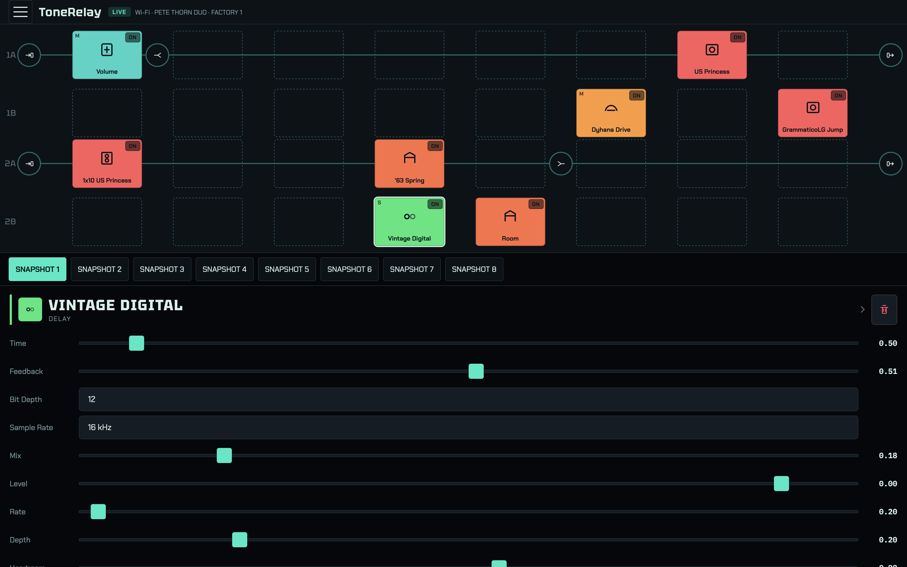
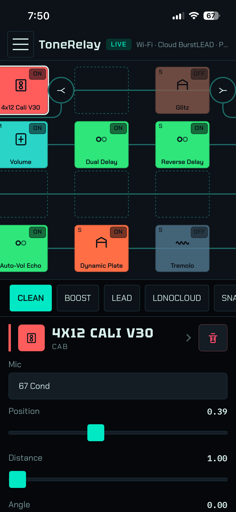
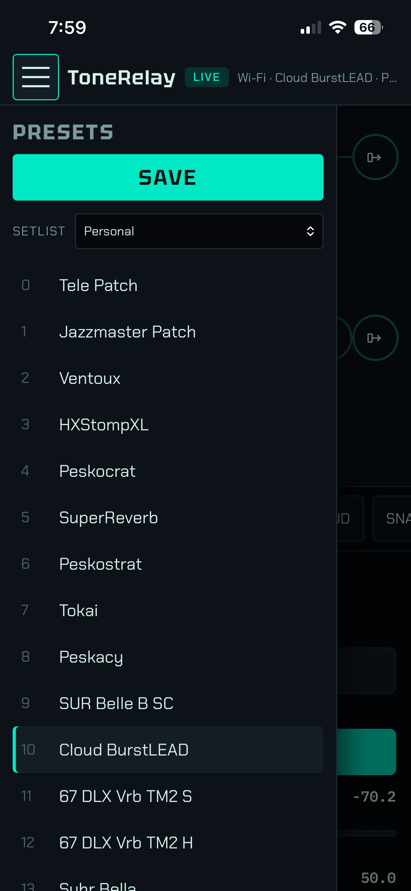
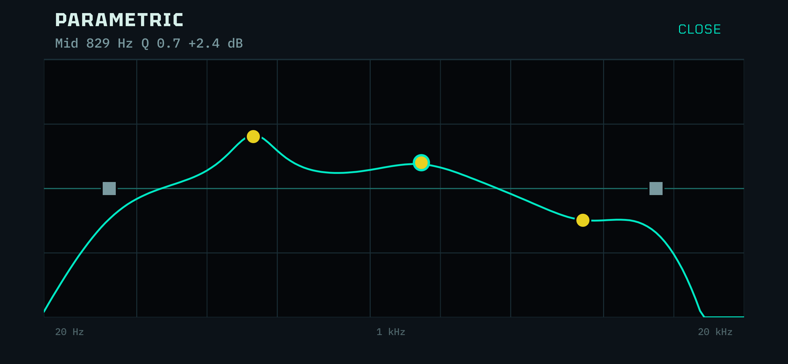
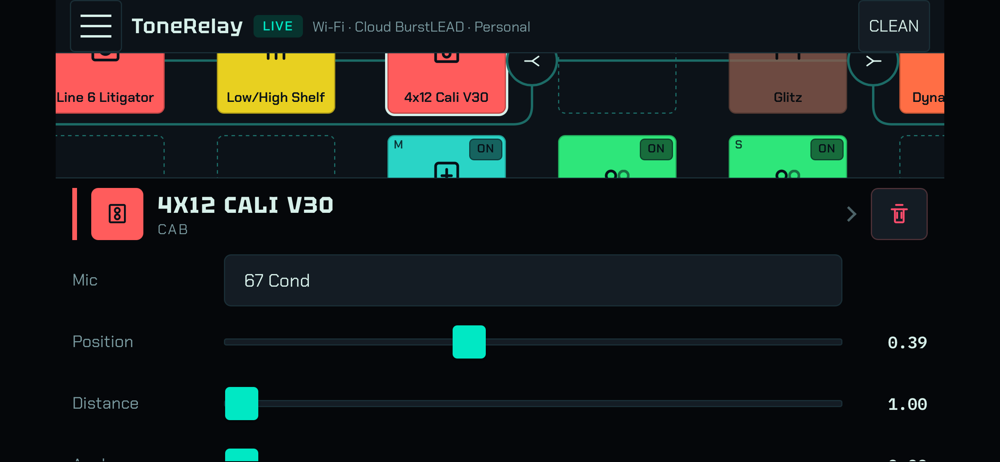

# ToneRelay

ToneRelay is a browser editor for a Line 6 Helix Floor. A Raspberry Pi talks
to the Helix over USB and serves the editor on your LAN, so you do not need
HX Edit on a Mac or Windows PC. The editor can be accessed with any desktop
or mobile device, via WiFi, providing a truly wireless HX-Edit-like experience.

Verified on Helix Floor firmware 3.80.



## Disclaimer

ToneRelay is an independent project. It is not affiliated with, authorized,
endorsed, or sponsored by Line 6 or Yamaha Guitar Group. "Line 6", "Helix",
"HX", and "HX Edit" are trademarks of their respective owners and are used
here only to identify the hardware ToneRelay talks to.

The software is provided "as is", without warranty of any kind. You assume
all risk. Back up your presets before you write to the device.

## Current Features





* Browser-based GUI adapts to any screen size.
* Currently optimized for mobile devices in portrait mode.
* Model Browsing
* Preset Browsing
* Drag and Drop blocks (with the same path)
* Full parameter editing
* Parametric EQ graph

## Future Features/Ideas

* Support for Helix LT, HX Stomp, HX Stomp XL and HX Effects
* Command Centre
* Footswitch Assignments
* User Favourites
* Download/Upload/Manage HLX and IR files
* Alternate GUIs for EQs, Compressors and other blocks
* Stereo audio playback via AirPlay or Bluetooth
* Focus View (from Helix Stadium) adaptation

## Background

This project started out with the question: is it possible to build an iOS
app for my Helix Floor? Two issues immediately surfaced. Firstly, connecting
a peripheral device to an iOS device would require development of a driver
and would require Apple's review and approval. To my very limited understanding
of the process, this would almost certainly fail.

Secondly, even if such a driver could be developed and accepted, along with
an app, Line 6 would likely not be comfortable with a third-party app on the
AppStore for their product. They would likely be well within their legal right
to request it be taken down and this would to me be a completely understandable
request.

The workaround for these two limitations is to:
1. Remove the USB cable and make the communication wireless and;
2. Serve the app via a browser, bypassing any app approval requirements.

The Helix Floor obviously does not have wireless capabilities built-in, so
this has to be added via a USB to WiFi/Bluetooth adapter. This project has been
developed so far on a Raspberry Pi and can be deployed to a Pi 4 or 5.

The ultimate goal is to be able to optimize this app for a Pi Zero 2 W and
potentially an ESP32-P4. These devices can be powered for several hours with
a LiPo battery.

It's a fair question to ask - if you're having to connect something like a
Raspberry Pi via USB (and power it with an adapter), then what are you really
gaining over just connecting a cable to your laptop and using HX Edit?

If I can ultimately get this working on a Pi Zero 2 W or ESP32-P4 with a
battery, then these low-cost devices are more like 'gadgets' than they are
computers. They are essentially equivalent to a Line 6 Relay adapter versus
a standard guitar cable. If you want a wireless guitar signal then you need an
adapter and if you want wireless preset editing then you also need an adapter.

Serving the app via a browser allows for virtually universal compatibility.
With HTML5, JS and React it's trivial for an AI to build a working prototype.
This can then be added to the home screen as a webapp and to all appearances
functions just like a regular app.

## Requirements

- Raspberry Pi 4 or 5 running 64-bit Raspberry Pi OS
- Internet access on the Pi (clone and first build)
- Helix Floor, connected to the Pi with USB

## Install

1. Clone the repository:

```sh
git clone --recurse-submodules https://github.com/mpeskett88/ToneRelay.git
cd ToneRelay
```

2. Run the installer:

```sh
sudo ./scripts/install.sh
```

The first run compiles the USB daemon and the web GUI. That can take a long
time on a Pi. The script prefers HTTP port 80, then 8080, and asks you for a
port if both are taken. Pass `--port N` to choose a port yourself.

When it finishes, it prints URLs for the editor. If it stops with an error
before that, the systemd services are not installed yet. Fix the error and
run the installer again.

## Open the editor

Put your phone or computer on the same Wi-Fi as the Pi. Open the URL the
installer printed, then tap **Wi-Fi**.

If `http://HOSTNAME.local/` does not load, use the IP address the installer
printed. On iPhone, you can use Share → Add to Home Screen.

## Model names and the model picker

Names, ranges, and the model picker come from HX Edit data files. Those files
are Line 6's and are not included here.

The editor still talks to the Helix without them. Knobs may show numbers, and
you cannot open the model sheet until the catalog is present.

On a Raspberry Pi, use the Windows HX Edit installer (`.exe`). The macOS
`.dmg` only extracts on macOS. Point the install script at the `.exe`:

```sh
sudo HX_EDIT_INSTALLER=/path/to/HXEdit.exe ./scripts/install.sh
```

To add the catalog later:

```sh
./scripts/extract-hx-catalog.sh /path/to/HXEdit.exe
sudo systemctl restart hxbridge-usb.service
```

You can also extract the catalog on a Mac from the `.dmg`, then copy
`~/.local/share/tonepush/hx-resources` onto the Pi.

## Safety

- Use the editor only on a trusted LAN. There is no login. Traffic is HTTP.
- Do not port-forward the editor to the internet.
- Do not flash firmware with this project.
- The Helix accepts one USB host at a time. Stop the Pi services before you
  plug the Helix into a computer running HX Edit:

```sh
sudo systemctl stop hxbridge-http.service hxbridge-usb.service
```

## Update and uninstall

```sh
git pull
sudo ./scripts/install.sh
```

```sh
sudo ./scripts/install.sh --uninstall
```

Uninstall removes the services, udev rule, and Avahi advertisement. It leaves
the clone, Rust, and Node on the Pi.

## Use the network backend from another app

The Pi exposes the same JSON commands over a WebSocket (`ws://HOST/ws`). You
can drive that socket from your own editor and skip the ToneRelay GUI. See
[docs/integrators.md](docs/integrators.md).

## Acknowledgements

ToneRelay stands on work that other people published first. Thank you.

- [TonePush](https://github.com/crmne/tonepush) is the USB engine. The daemon
  uses its `hx-proto`, `hx-usb`, and `hx-catalog` crates for the live session,
  preset document, and optional HX Edit catalog. The catalog extract script
  is TonePush's as well.
- [openhx](https://github.com/allansomensi/openhx) was the first USB stack in
  this tree. It proved Helix Floor list and select on firmware 3.80 and is
  still here as a lab CLI.
- [helix_usb](https://github.com/kempline/helix_usb) is a Python reference
  for HX USB framing. Captures were checked against it so this project did
  not send packets from the wrong channel.

## License

MIT. See [LICENSE](LICENSE).

Lab notes, GATT details, and capture recipes are in
[docs/development.md](docs/development.md).
