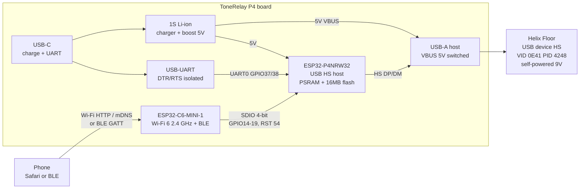
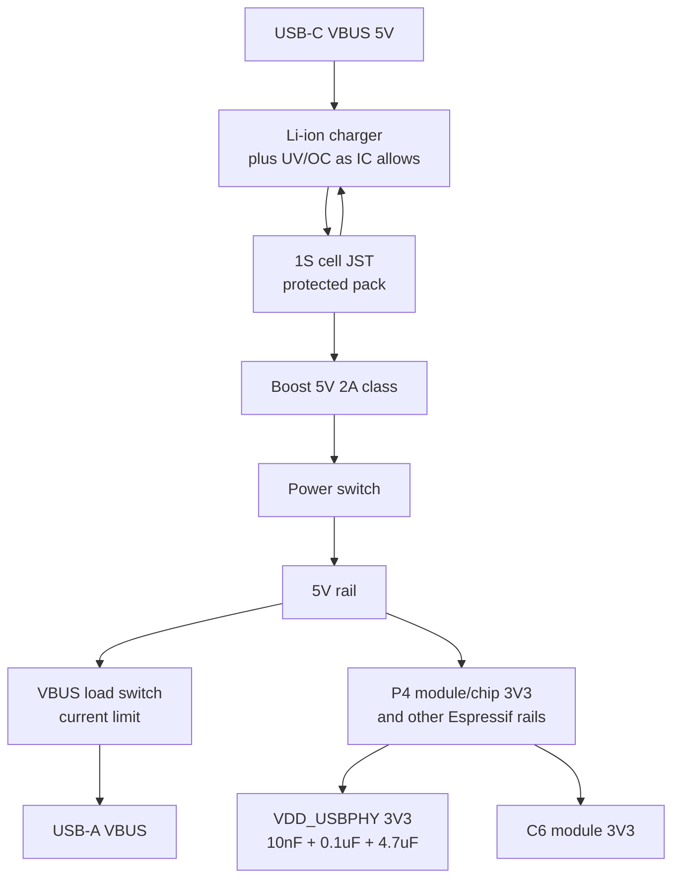
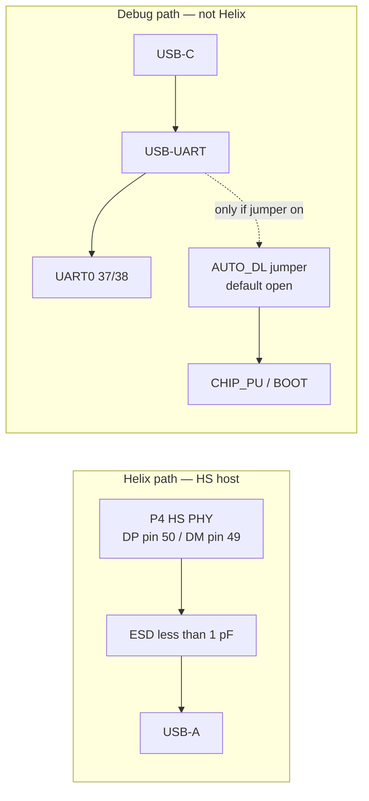
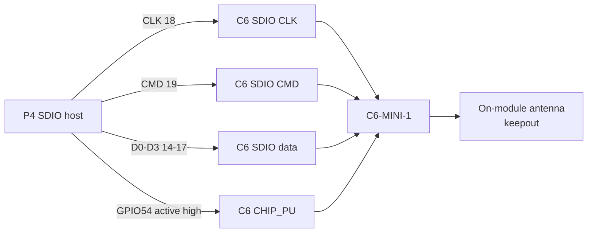

# Block diagrams

These diagrams are the cover-sheet drawing. Copy the boxes onto the KiCad schematic. Do not add Ethernet, MIPI, codec, or a USB hub.

## System

USB roles: the phone is not a USB host for the Helix. The P4 is the only USB host.

## Power tree

If the P4NRW32 reference schematic wants 5 V into an onboard DCDC, feed that 5 V from `v5`, not from USB-A VBUS. USB-A VBUS is an **output**.

## USB and debug (do not mix)

P4 also has Full-Speed USB Serial/JTAG on GPIO24 (D−) and GPIO25 (D+). Optional test pads only on rev 1. Do not wire those GPIOs to the USB-A Helix connector.

## Radio

Copy C6 pad numbers from the [NANO schematic](https://files.waveshare.com/wiki/ESP32-P4-NANO/ESP32-P4-NANO-schematic.pdf) and the C6-MINI-1 datasheet. Do not guess C6 ball IDs.

## Data path (firmware, for context)

The PCB does not implement this. It only has to keep 3V3, SDIO, and HS USB alive while it runs.
